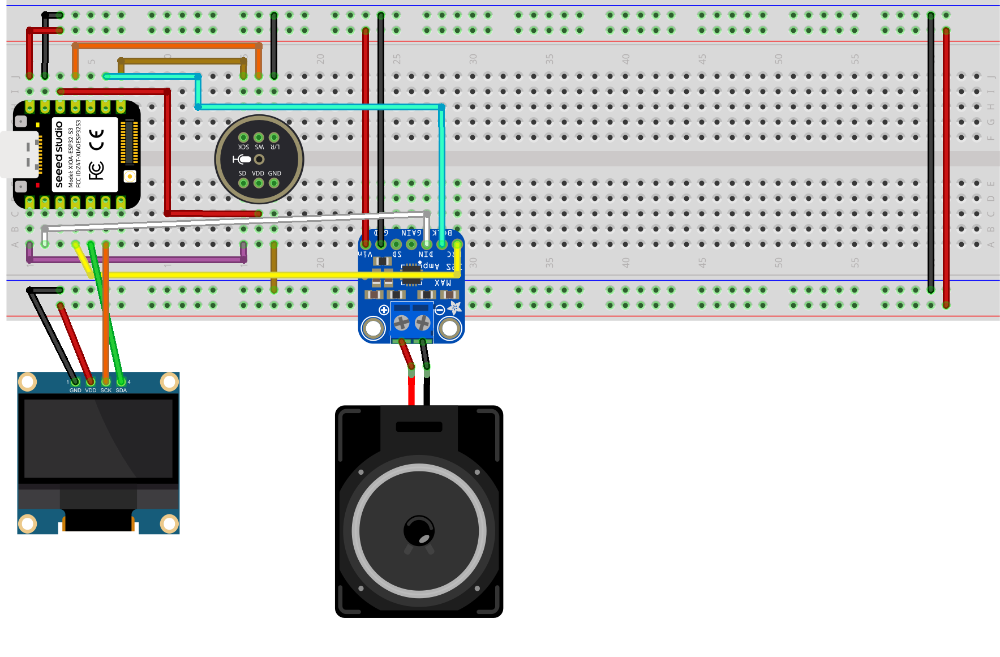

# Xiaozhi AI Desk Buddy (ESP32-S3)

An expressive AI desk companion built using the Xiao ESP32-S3, OLED display, I2S MEMS microphone, and MAX98357A amplifier.

This project extends the Xiaozhi firmware with a fully animated face system including:

- Idle animation
- Random blinking
- Listening expression
- Speaking mouth animation
- OTA support
- SPIFFS asset storage

---

## Hardware Used

- Seeed Xiao ESP32-S3
- 128x64 OLED Display (I2C)
- I2S MEMS Microphone (3.3V)
- MAX98357A I2S Amplifier
- 4Ω 3W Speaker
- Breadboard (final build optional)

---

## Features

- Expressive animated eyes
- Natural blinking system
- Dynamic speaking mouth animation
- Listening pose with perspective eye scaling
- OTA partition layout
- SPIFFS assets support
- Batch flasher for Windows

---

## 💸 Get Your ESP32 at a Discount

[🛒 Buy the Seeed XIAO ESP32S3 from Seeed Studio](https://www.seeedstudio.com/XIAO-ESP32S3-p-5627.html?sensecap_affiliate=P9GHEkF&referring_service=link)

Use promo code **`N891LZX6`** at checkout for a discount!

---

---

## 🔌 Wiring

| OLED Pin | Xiao ESP32-S3 |
|-----------|--------------------------|
| SDA       | GPIO5 (D4)               |
| SCL       | GPIO6 (D5)               |
| VCC       | 3.3V / 5V                |
| GND       | GND                      |
| |
| Microphone Pin |   |
| SCK / BCLK     | GPIO44  (D7)             |
| WS / LRCK      | GPIO9  (D10)              |
| SD / DOUT      | GPIO1   (D0)             |
| VCC            | 3.3V                     |
| GND            | GND                      |
| |
| MAX98357A Pin |   |
| BCLK          | GPIO7  (D8)               |
| LRC / LRCK    | GPIO4  (D3)              |
| DIN           | GPIO2  (D1)               |
| VIN           | 5V (recommended)         |
| GND           | GND                      |
---
## 🔧 Circuit diagram

